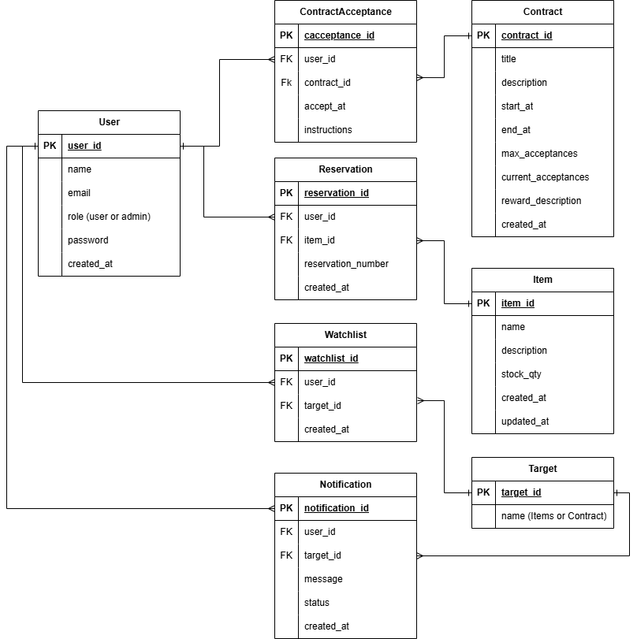

# DEV1003_A2_BackEnd_GAMS

Back-end REST API for the Guild Availability Management System (GAMS) — a MERN stack project for DEV1003 at Coder Academy. Built with Node.js, Express and MongoDB, handling auth, reservations, contracts, watchlists and notifications.

## 1. Tecnologies

The technologies used in this project reflect the tools and practices taught throughout DEV1003 — Advanced Applications at Coder Academy. Each dependency was selected in alignment with the course curriculum, ensuring that the stack represents current industry standards and prepares the team for professional software development environments.

### 2.1 Hardware Requeriments

write here

### 2.2 Software Requeriments

write here

### 2.2.1 Production Dependencies Packages

write about

| Package        | Purpose                                              |
| -------------- | ---------------------------------------------------- |
| `express`      | Web server framework                                 |
| `mongoose`     | MongoDB ODM — models and schema validation           |
| `jsonwebtoken` | Generate and verify JWT tokens for auth              |
| `bcrypt`       | Hash and compare passwords securely                  |
| `cors`         | Allow cross-origin requests from the React front-end |
| `dotenv`       | Load environment variables from `.env`               |

### 2.2.2 Development Dependencies Packages

write about

| Package     | Purpose                                                     |
| ----------- | ----------------------------------------------------------- |
| `jest`      | Testing framework                                           |
| `supertest` | HTTP assertions for testing Express routes                  |
| `nodemon`   | Auto-restarts the server on file changes during development |

## 2. Entities

where they come, why they are here, Entities tell us its attributes and its relationships with other entities

### 1. User

The central entity of the system. Every action — reserving an item, accepting a contract, watching, or receiving a notification — is tied to a User.

| Field | Key | Type | Notes |
| :--- | :---: | :--- | :--- |
| `user_id` | PK | ObjectId | Auto-generated by MongoDB (`_id`) |
| `name` | | String | Required |
| `email` | | String | Required, unique |
| `role` | | String | `"user"` or `"admin"` — drives role-based authorisation |
| `password` | | String | Required, stored as a bcrypt hash |
| `created_at` | | Date | Defaults to `Date.now` |

**Relationships:** One User has many Reservations, ContractAcceptances, Watchlist entries, and Notifications.

### 2. Item

An inventory-based artifact that users can reserve while stock is available. When `stock_qty` reaches zero the item becomes unavailable and users may add it to their Watchlist.

| Field | Key | Type | Notes |
| :--- | :---: | :--- | :--- |
| `item_id` | PK | ObjectId | Auto-generated by MongoDB (`_id`) |
| `name` | | String | Required |
| `description` | | String | |
| `stock_qty` | | Number | Required; decremented on each Reservation |
| `created_at` | | Date | Defaults to `Date.now` |
| `updated_at` | | Date | Updated on every stock change |

**Relationships:** One Item has many Reservations. Referenced by Watchlist and Notification via the `Target` entity.

### 3. Contract

A time-windowed quest that users can accept within a defined availability window and while `current_acceptances` is below `max_acceptances`.

| Field | Key | Type | Notes |
| :--- | :---: | :--- | :--- |
| `contract_id` | PK | ObjectId | Auto-generated by MongoDB (`_id`) |
| `title` | | String | Required |
| `description` | | String | |
| `start_at` | | Date | Required; contract becomes available from this datetime |
| `end_at` | | Date | Required; contract closes at this datetime |
| `max_acceptances` | | Number | Required; maximum number of users who can accept |
| `current_acceptances` | | Number | Incremented on each ContractAcceptance |
| `reward_description` | | String | Instructions for collecting the reward in person |
| `created_at` | | Date | Defaults to `Date.now` |

**Relationships:** One Contract has many ContractAcceptances. Referenced by Watchlist and Notification via the `Target` entity.

### 4. Target

A lookup entity that identifies whether a Watchlist entry or Notification refers to an Item or a Contract. This allows the Watchlist and Notification models to remain generic and reusable across both entity types.

| Field | Key | Type | Notes |
| :--- | :---: | :--- | :--- |
| `target_id` | PK | ObjectId | Auto-generated by MongoDB (`_id`) |
| `name` | | String | `"Item"` or `"Contract"` |

**Relationships:** Referenced by Watchlist (`target_id`) and Notification (`target_id`).

### 5. Reservation

Created when a User reserves an Item. Stores the generated reservation number used for in-person payment and collection at the guild.

| Field | Key | Type | Notes |
| :--- | :---: | :--- | :--- |
| `reservation_id` | PK | ObjectId | Auto-generated by MongoDB (`_id`) |
| `user_id` | FK | ObjectId | References `User` |
| `item_id` | FK | ObjectId | References `Item` |
| `reservation_number` | | String | Auto-generated unique identifier for in-person collection |
| `created_at` | | Date | Defaults to `Date.now` |

**Relationships:** Belongs to one User and one Item.

### 6. ContractAcceptance

Created when a User accepts a Contract within its active time window. Stores the instructions the user presents to the guild upon completion.

| Field | Key | Type | Notes |
| :--- | :---: | :--- | :--- |
| `cacceptance_id` | PK | ObjectId | Auto-generated by MongoDB (`_id`) |
| `user_id` | FK | ObjectId | References `User` |
| `contract_id` | FK | ObjectId | References `Contract` |
| `accept_at` | | Date | Timestamp of acceptance; defaults to `Date.now` |
| `instructions` | | String | Directions generated at acceptance for in-person reward collection |

**Relationships:** Belongs to one User and one Contract.

### 7. Watchlist

Created when a User watches an unavailable Item or Contract. The `target_id` field points to the `Target` entity to identify which type of entity is being watched.

| Field | Key | Type | Notes |
| :--- | :---: | :--- | :--- |
| `watchlist_id` | PK | ObjectId | Auto-generated by MongoDB (`_id`) |
| `user_id` | FK | ObjectId | References `User` |
| `target_id` | FK | ObjectId | References `Target` (Item or Contract) |
| `created_at` | | Date | Defaults to `Date.now` |

**Relationships:** Belongs to one User. References one Target (which resolves to an Item or Contract).

### 8. Notification

Generated automatically when a watched Item is restocked or a watched Contract opens. Delivered to the User who added the item or contract to their Watchlist.

| Field | Key | Type | Notes |
| :--- | :---: | :--- | :--- |
| `notification_id` | PK | ObjectId | Auto-generated by MongoDB (`_id`) |
| `user_id` | FK | ObjectId | References `User` |
| `target_id` | FK | ObjectId | References `Target` (Item or Contract) |
| `message` | | String | Human-readable notification text |
| `status` | | String | `"unread"` or `"read"` |
| `created_at` | | Date | Defaults to `Date.now` |

**Relationships:** Belongs to one User. References one Target (which resolves to an Item or Contract).

### Entity Relationship Summary

| Entity | Relates To | Relationship Type |
| :--- | :--- | :--- |
| User | Reservation | One-to-Many |
| User | ContractAcceptance | One-to-Many |
| User | Watchlist | One-to-Many |
| User | Notification | One-to-Many |
| Item | Reservation | One-to-Many |
| Contract | ContractAcceptance | One-to-Many |
| Target | Watchlist | One-to-Many |
| Target | Notification | One-to-Many |

---

## 3. API Endpoints

Once the ERD is solid, you derive your API endpoints. Each entity needs routes for the operations users perform on it, as described in the user stories. If an action appears in a user story, it needs an endpoint. If an entity appears in the ERD, it needs routes. If a persona has restricted access, it needs middleware. Three Sources that tell you what endpoints to build:
- ### Source 1 — User Stories (the "what")
Every user story describes an action a user needs to perform. Each action that involves data being created, read, updated, or deleted requires an endpoint.
The formula is simple:
"As a [persona], I want to [action]" → that action needs an API endpoint. 
For Example:
User Story Action: Browse available items
HTTP Verb: GET
Why: Reading a list of data

- ### Source 2 — ERD (the "who" and "what connects to what")
The ERD tells you which entities exist and how they relate. Every entity in your ERD that a user interacts with needs at minimum a GET endpoint. Every entity that gets created, updated, or deleted through user actions needs the corresponding verb.
Ask these four questions for each entity:

| Question                             | If yes → add this endpoint               |
| ------------------------------------ | ---------------------------------------- |
| Does a user need to **see** this?    | `GET /entity` and `GET /entity/:id`      |
| Does a user need to **create** this? | `POST /entity`                           |
| Does a user need to **change** this? | `PUT /entity/:id` or `PATCH /entity/:id` |
| Does a user need to **remove** this? | `DELETE /entity/:id`                     |

- ### Source 3 — Access Control (the "who can do it")
The user stories define two personas — Guild Member and Guild Administrator. This tells you which endpoints are public, which require authentication, and which require admin role.

| If the action...                    | Then the endpoint is...                      |
| ----------------------------------- | -------------------------------------------- |
| Anyone can do it without logging in | Public — no middleware                       |
| Only logged-in members can do it    | Protected — needs `verifyToken`              |
| Only admins can do it               | Admin-only — needs `verifyToken` + `isAdmin` |

### GAMS — Full API Endpoint

Legend

| Symbol    | Meaning                                      |
| --------- | -------------------------------------------- |
| `—`       | No middleware required (public)              |
| `VT`      | `verifyToken` — authenticated users only     |
| `VT + IA` | `verifyToken` + `isAdmin` — admin users only |

- ### Auth — /auth

| # | Method | Path             | Access | Middleware | Description                         |
| - | ------ | ---------------- | ------ | ---------- | ----------------------------------- |
| 1 | `POST` | `/auth/register` | Public | `—`        | Register a new guild member account |
| 2 | `POST` | `/auth/login`    | Public | `—`        | Authenticate and receive a JWT      |
| 3 | `POST` | `/auth/logout`   | User   | `VT`       | Log out (client discards token)     |

- ### Items — /items

| #  | Method  | Path                    | Access | Middleware | Description                                          |
| -- | ------- | ----------------------- | ------ | ---------- | ---------------------------------------------------- |
| 10 | `GET`   | `/contracts`            | User   | `VT`       | Browse all contracts (filter by type / availability) |
| 11 | `GET`   | `/contracts/:id`        | User   | `VT`       | View a single contract's details                     |
| 12 | `POST`  | `/contracts/:id/accept` | User   | `VT`       | Accept an available contract                         |
| 13 | `POST`  | `/contracts`            | Admin  | `VT + IA`  | Create a new contract                                |
| 14 | `PUT`   | `/contracts/:id`        | Admin  | `VT + IA`  | Edit an existing contract                            |
| 15 | `PATCH` | `/contracts/:id/dates`  | Admin  | `VT + IA`  | Update contract start and end dates                  |

- ### Contracts — /contracts

| #  | Method  | Path                    | Access | Middleware | Description                                          |
| -- | ------- | ----------------------- | ------ | ---------- | ---------------------------------------------------- |
| 10 | `GET`   | `/contracts`            | User   | `VT`       | Browse all contracts (filter by type / availability) |
| 11 | `GET`   | `/contracts/:id`        | User   | `VT`       | View a single contract's details                     |
| 12 | `POST`  | `/contracts/:id/accept` | User   | `VT`       | Accept an available contract                         |
| 13 | `POST`  | `/contracts`            | Admin  | `VT + IA`  | Create a new contract                                |
| 14 | `PUT`   | `/contracts/:id`        | Admin  | `VT + IA`  | Edit an existing contract                            |
| 15 | `PATCH` | `/contracts/:id/dates`  | Admin  | `VT + IA`  | Update contract start and end dates                  |

- ### Reservations — /reservations

| #  | Method   | Path                | Access | Middleware | Description                         |
| -- | -------- | ------------------- | ------ | ---------- | ----------------------------------- |
| 16 | `GET`    | `/reservations`     | User   | `VT`       | Get the current user's reservations |
| 17 | `GET`    | `/reservations/:id` | User   | `VT`       | Get a single reservation's details  |
| 18 | `DELETE` | `/reservations/:id` | User   | `VT`       | Cancel a reservation                |

- ### Contract Acceptances — /acceptances

| #  | Method   | Path               | Access | Middleware | Description                               |
| -- | -------- | ------------------ | ------ | ---------- | ----------------------------------------- |
| 19 | `GET`    | `/acceptances`     | User   | `VT`       | Get the current user's accepted contracts |
| 20 | `GET`    | `/acceptances/:id` | User   | `VT`       | Get a single acceptance record's details  |
| 21 | `DELETE` | `/acceptances/:id` | User   | `VT`       | Withdraw from an accepted contract        |

- ### Watchlist — /watchlist

| #  | Method   | Path             | Access | Middleware | Description                              |
| -- | -------- | ---------------- | ------ | ---------- | ---------------------------------------- |
| 22 | `GET`    | `/watchlist`     | User   | `VT`       | Get the current user's watchlist         |
| 23 | `POST`   | `/watchlist`     | User   | `VT`       | Add an item or contract to the watchlist |
| 24 | `DELETE` | `/watchlist/:id` | User   | `VT`       | Remove an entry from the watchlist       |

- ### Notifications — /notifications

| #  | Method   | Path                      | Access | Middleware | Description                          |
| -- | -------- | ------------------------- | ------ | ---------- | ------------------------------------ |
| 25 | `GET`    | `/notifications`          | User   | `VT`       | Get the current user's notifications |
| 26 | `PATCH`  | `/notifications/:id/read` | User   | `VT`       | Mark a notification as read          |
| 27 | `DELETE` | `/notifications/:id`      | User   | `VT`       | Delete a notification                |

- ### Dashboard — /dashboard

| #  | Method | Path         | Access | Middleware | Description                                                                               |
| -- | ------ | ------------ | ------ | ---------- | ----------------------------------------------------------------------------------------- |
| 28 | `GET`  | `/dashboard` | User   | `VT`       | Get the current user's full summary — reservations, acceptances, and unread notifications |

- ### Admin — /admin

| #  | Method   | Path               | Access | Middleware | Description                       |
| -- | -------- | ------------------ | ------ | ---------- | --------------------------------- |
| 29 | `GET`    | `/admin/users`     | Admin  | `VT + IA`  | List all registered users         |
| 30 | `GET`    | `/admin/users/:id` | Admin  | `VT + IA`  | View a single user's full details |
| 31 | `DELETE` | `/admin/users/:id` | Admin  | `VT + IA`  | Remove a user from the system     |